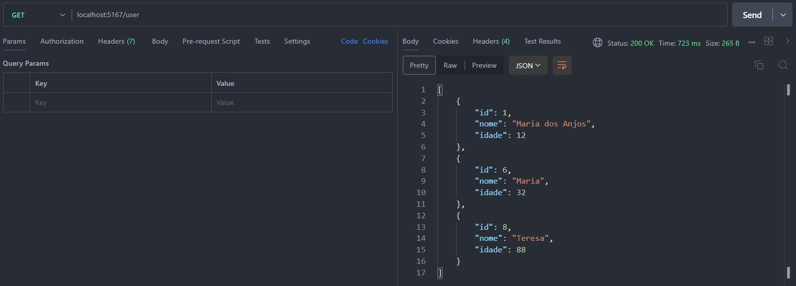
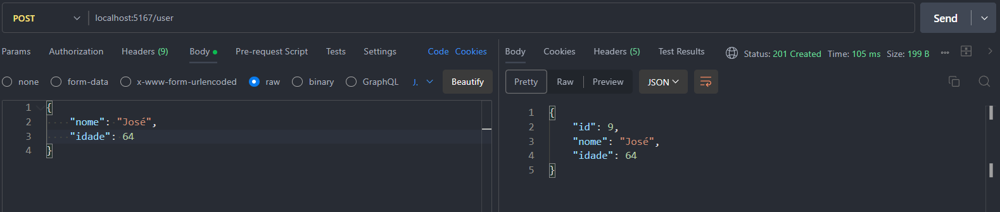
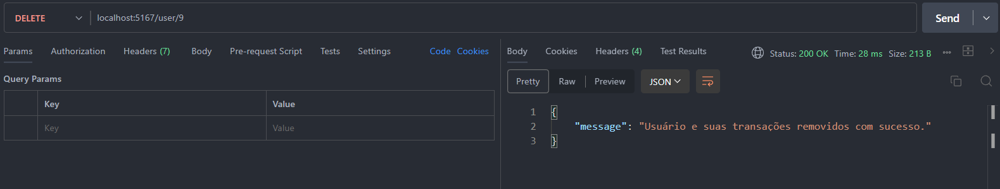
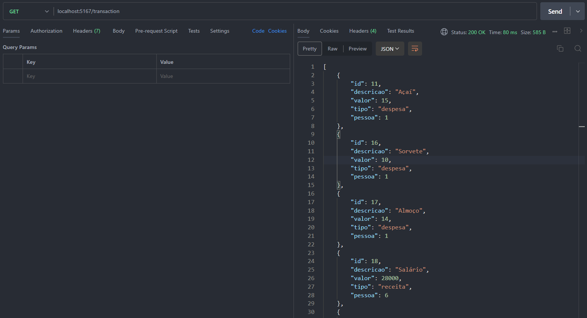
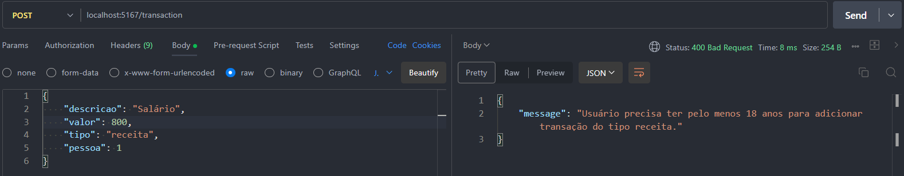
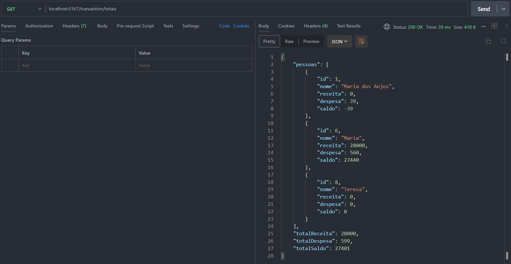

# Sistema de gerenciamento de gastos residenciais

O sistema visa organizar o financeiro de membros de uma residência.
## Objetivos

Facilitar o monitoramento das transações individuais e coletivas de membros de uma residência.
## Funcionalidades

- Cadastro de pessoas
- Cadastro de transações
- Consulta de totais
## Stack utilizada

**Back-end:** C#, ASP.NET Core
## Rodando localmente

Entre no diretório do projeto

```bash
  cd DRcSharp
```

Instale as dependências

```bash
  dotnet add package Microsoft.AspNetCore.OpenApi --version 8.0.14
  dotnet add package MySql.Data --version 9.0.0
```

Inicie o servidor

```bash
  dotnet run
```
## Documentação da API

#### Rota de requisição e listagem de membros cadastrados

```http
  GET localhost:5167/user
```


#### Rota para acrescentar um novo membro na residência

```http
  POST localhost:5167/user
```


#### Rota para deleção de algum usuário

```http
  DEL localhost:5167/user/:id
```


#### Rota de requisição e listagem das transações cadastradas

```http
  GET localhost:5167/transaction
```


#### Rota para inserção de transações

```http
  POST localhost:5167/transaction
```


#### Rota de requisição e listagem dos totais individuais e coletivo

```http
  GET localhost:5167/transaction/totais
```


## 🛠 Habilidades
MySQL, dotNET e Postman


## 🔗 Links
[](https://www.linkedin.com/in/nivaldo-guedes-49b49a228//)

[](https://www.instagram.com/nivaldoguedes/)
# Olá, eu sou o Nivaldo! 👋


## 🚀 Sobre mim
Eu sou um estudante de engenharia da computação na UNIVASF - Universidade Federal do Vale do São Francisco e atualmente estou me aventurando com o desenvolvimento back-end.


🧠 Estou aprendendo desenvolvimento back-end

📫 Como entrar em contato comigo: guedes.nivaldo@gmail.com

😄 Pronomes: ele/dele
## Feedback

Se você tiver algum feedback, por favor me deixe saber por meio de guedes.nivaldo@gmail.com


## Autor

- [@nivaldoguedes](https://github.com/nivaldoguedes)

